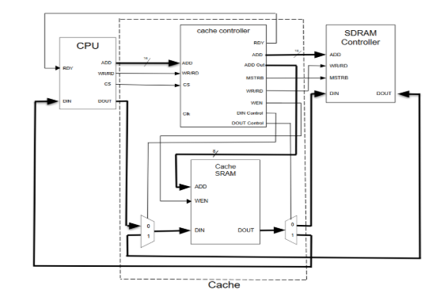
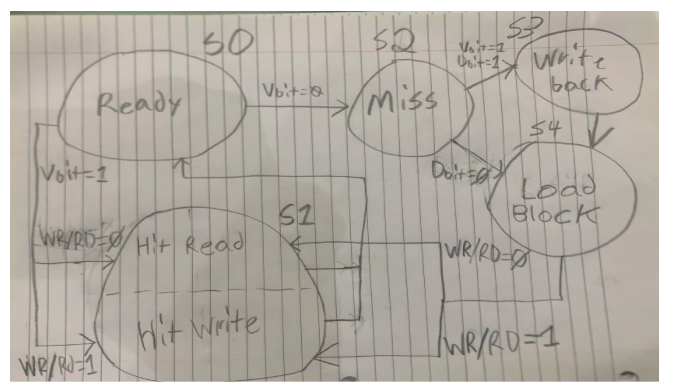
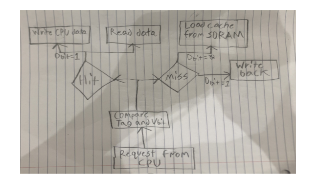
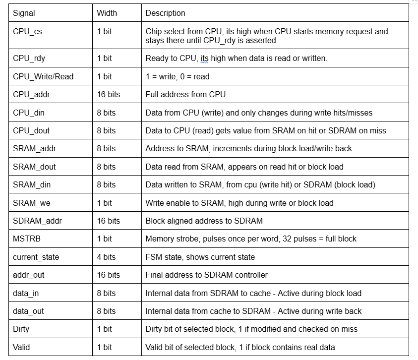

# FPGA Cache Controller – Direct-Mapped Write-Back Cache in VHDL

**Description**  
This project designs and implements a fully functional direct-mapped write-back cache controller in VHDL for the Xilinx Spartan-3E FPGA. It integrates a simulated CPU with on-chip SRAM (256-byte cache: 8 blocks × 32 bytes) and an SDRAM controller to demonstrate real-world memory hierarchy behavior using hit/miss detection, valid/dirty bits, and write-back policy. The FSM-based design was verified through waveform simulation and ChipScope timing analysis.

The exact project specifics are [here](https://www.ee.torontomu.ca/~lkirisch/ele758/labs/Cache%20Project[12-09-10].pdf).

**Overview**  
This project implements a cache controller in VHDL on the Xilinx Spartan-3E FPGA, connecting a simulated CPU to on-chip SRAM and an external SDRAM controller. The direct-mapped cache consists of 8 blocks of 32 words each and is controlled by a finite state machine that handles address decoding, hit/miss detection, and write-back operations. The system was thoroughly tested across all cases including read/write hits, clean misses, and dirty block write-backs.

**Design Details**  

### Block Diagram  

### State Diagram  
  

### Process Diagram  

### Table  

### ChipScope Timing Results  
Measured performance parameters from ChipScope on the Spartan-3E FPGA:

| N | Cache performance parameter                        | Time in nS |
|---|----------------------------------------------------|------------|
| 1 | Hit / Miss determination time                      | 120        |
| 2 | Data access time                                   | 20         |
| 3 | Block replacement time                             | 2500       |
| 4 | Hit time (Case 1 and 2)                            | 160        |
| 5 | Miss penalty for Case 3 (when D-bit = 0)           | 2560       |
| 6 | Miss penalty for Case 4 (when D-bit = 1)           | 5080       |

**Conclusion**  
The implemented cache controller fully satisfies the design requirements. All FSM states transitioned correctly during simulation, with proper handling of hits, misses, block refills, and write-back operations. ChipScope waveforms and timing measurements confirmed accurate state sequencing, data transfers, and control signals, validating the controller’s correctness under all specified conditions.

**License**  
MIT License

Built in Toronto, Ontario 🇨🇦
